# 📚 SchoolBridge App

SchoolBridge is an **Android app built with Jetpack Compose** that connects schools, students, teachers, and parents in one platform.  
It provides a digital timetable, scheduling tools, and a messaging system to improve communication and time management in schools.

---

## 🎯 Why SchoolBridge?

In many high schools, most students are **boarding** — they live at school for an entire semester. This creates a gap in communication between parents and schools. Parents often only learn about problems (such as poor discipline, low marks, or sanctions) when it is already too late, sometimes even after a student is expelled.

SchoolBridge aims to **bridge this gap** by keeping parents continuously informed:

- **Academic Performance**: Parents can follow up on marks, progress, and conduct evaluations.
- **Discipline & Behavior**: Parents are notified about misconduct reports, conduct marks, and sanctions in real time.
- **Visit Tracking**: When a student is visited at school, parents are alerted. This is especially important in preventing risky or harmful visits (e.g., underage girls being visited by older men).
- **Permission Monitoring**: Parents can see when and why a student is granted permission to leave the school grounds.

By giving parents visibility into their children’s school life, SchoolBridge helps prevent surprises, strengthens trust between schools and families, and improves student safety and accountability.

🔗 Backend API: [SchoolBridgeApi (Spring Boot)](https://github.com/oresteGabo/SchoolBridgeApi)

---

## 🚀 Features

- **Timetable Management**
    - School administrators can set up official timetables.
    - Users (students/teachers) can add **self-schedules** to better manage their time.  
      *(Self-schedules only appear for the user who created them, even if shown in the timetable view).*
    - When a course is modified in the timetable, all concerned users (students + teachers) get notified.

- **Messaging System**
    - Built on **MQTT protocol** (`Eclipse Paho`).
    - Supports **message threads** instead of continuous chat.
    - Users get notified of role change requests, admin messages, and important announcements.

- **Role Management**
    - Users can request a role (e.g., student, teacher, admin).
    - School admins can approve/revoke requests.
    - Roles affect available functionality in the app.

- **Customization**
    - **Multi-language support**: English, French, Kinyarwanda (Swahili in progress).
    - **Themes & Material Design 3 expressive UI**: Light/dark mode, color palettes, etc.

- **Widgets**
    - Homescreen widget to quickly view the daily timetable.

---

## 🛠️ Tech Stack

- **Frontend (Android App)**
    - [Jetpack Compose](https://developer.android.com/jetpack/compose) (Material Design 3 expressive UI)
    - Kotlin Coroutines, ViewModel, Navigation

- **Messaging**
    - [MQTT](https://mqtt.org/) via [Eclipse Paho](https://www.eclipse.org/paho/)

- **Backend**
    - [Spring Boot](https://spring.io/projects/spring-boot) API
    - Relational Database (via SchoolBridge API repository)

---

## 📸 Screenshots

| Add Event | Daily Timetable | Weekly Timetable |
|-----------|-----------------|------------------|
| 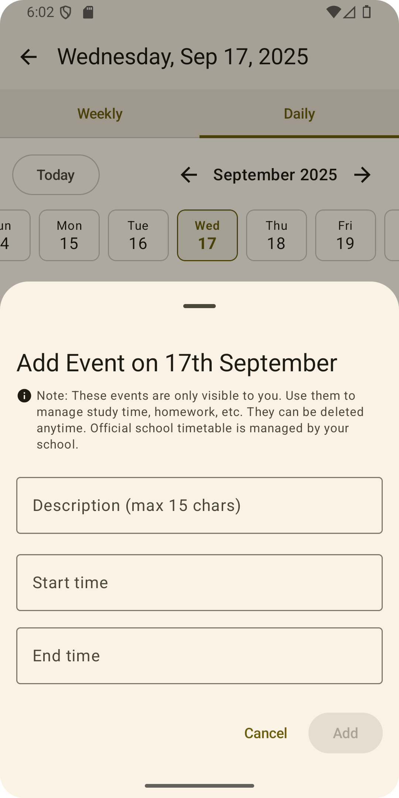 | 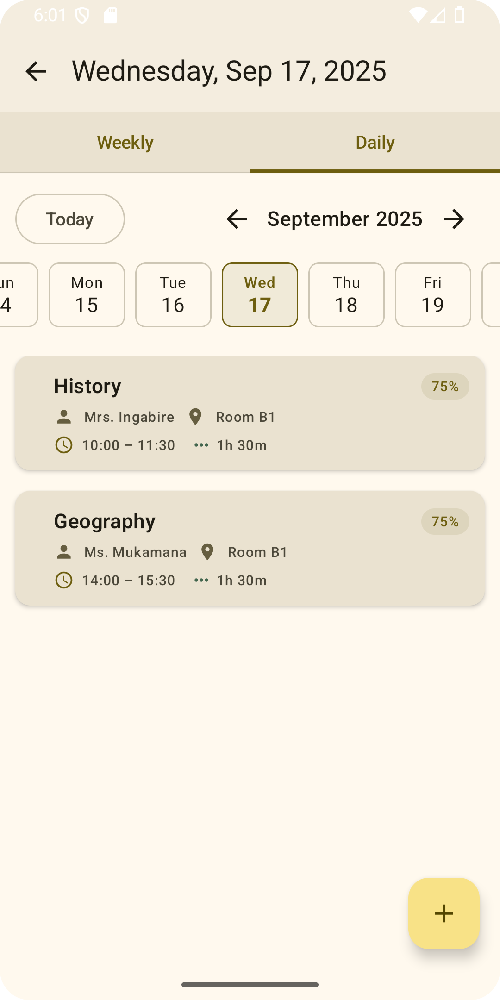 | 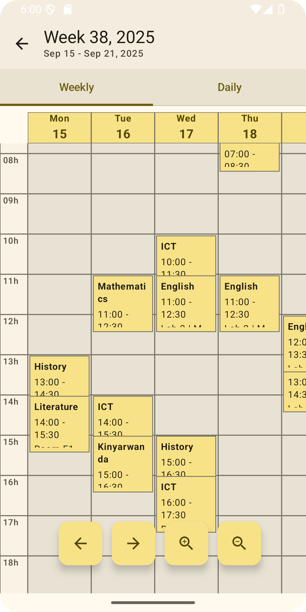 |

| Course Details | Empty Thread | Messages (Video) |
|----------------|--------------|------------------|
|  | 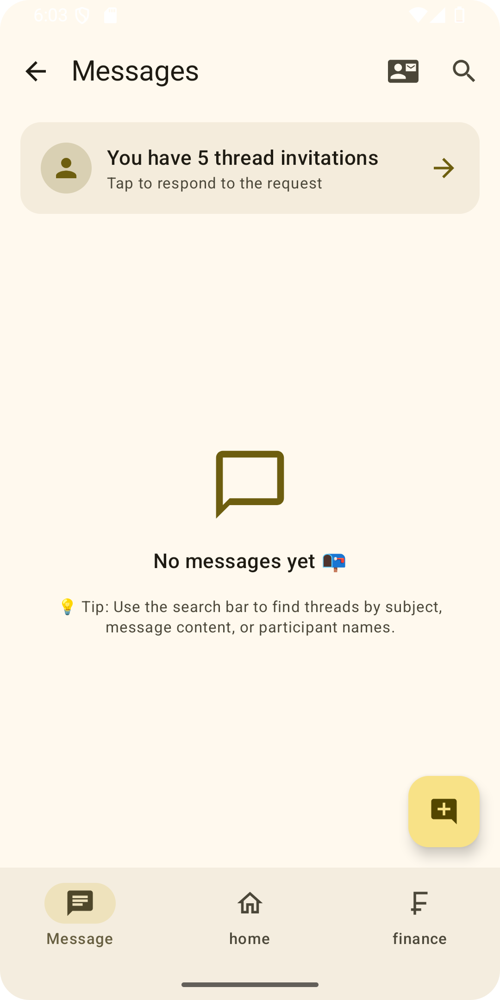 | 🥠[Watch Screen Recording](screenshots/message_threads_screen_record.mp4) |

| Role Change | Role Request | Language Change |
|-------------|--------------|-----------------|
| 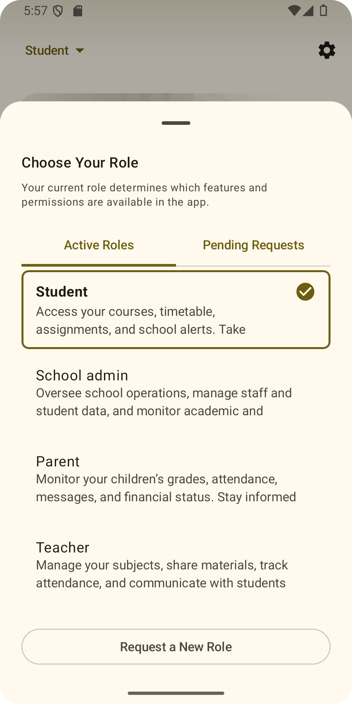 | 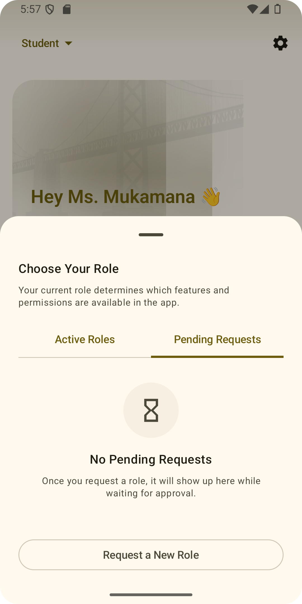 | 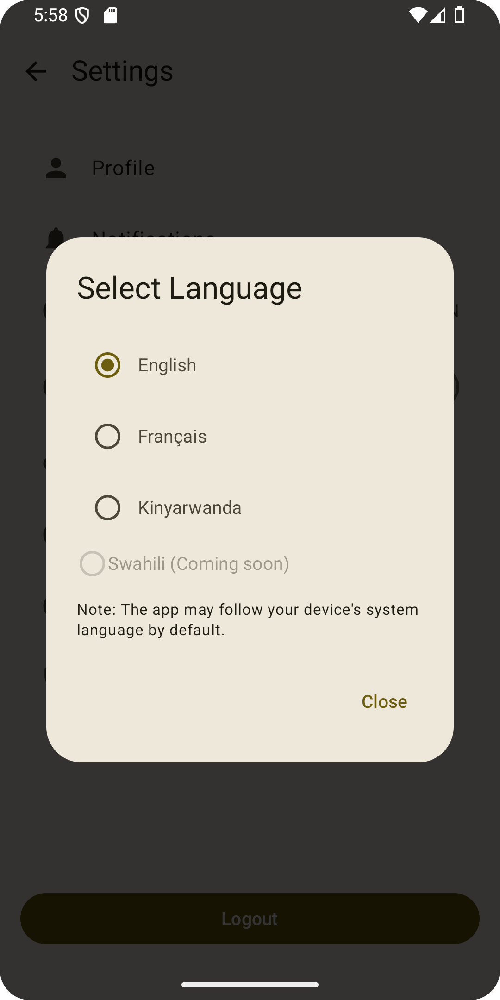 |

| Theme Change | Student Alerts | Teacher Homepage |
|--------------|----------------|------------------|
| 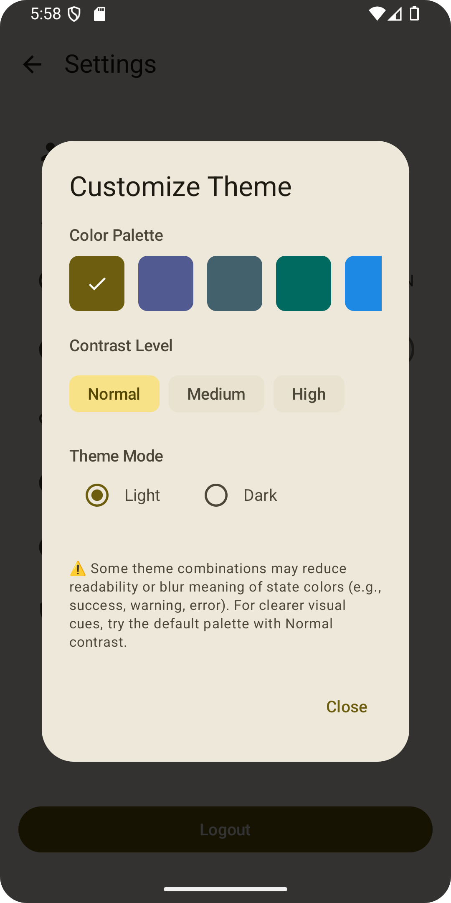 | 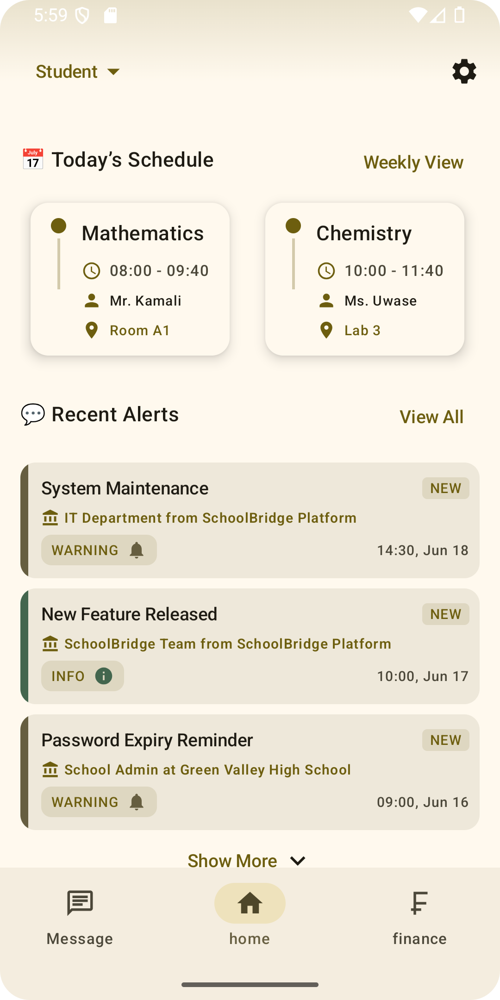 | 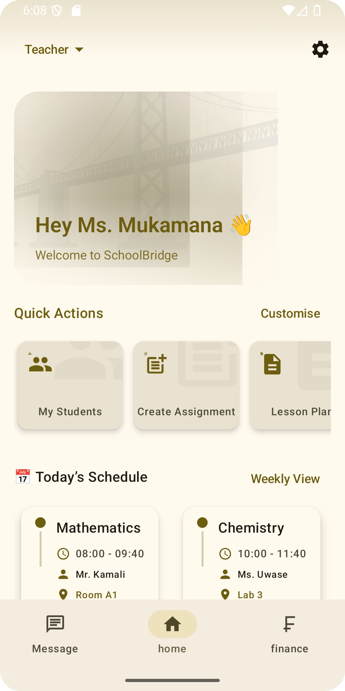 |

| Homescreen Widget |
|--------------------|
| 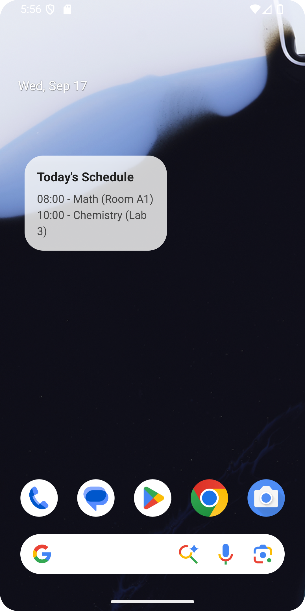 |

---

## 📂 Project Structure

- `app/` → Android app source code (Jetpack Compose UI, business logic, MQTT integration)
- `screenshots/` → Screenshots and demo video for documentation
- Backend API → [SchoolBridgeApi](https://github.com/oresteGabo/SchoolBridgeApi)

---

## 🌍 Roadmap

- ✅ Core timetable & messaging features
- ✅ Multi-language support (EN/FR/Kinyarwanda)
- 🔄 Add Swahili translation
- 🔄 Push notifications for important updates
- 🔄 Teacher/Parent dashboards
- 🔄 Advanced analytics & performance insights

---

## 🤝 Contributing

Contributions, issues, and feature requests are welcome!  
Feel free to open a PR or an issue in the repository.

---

## 📜 License

MIT License (or whichever license you choose)

---
